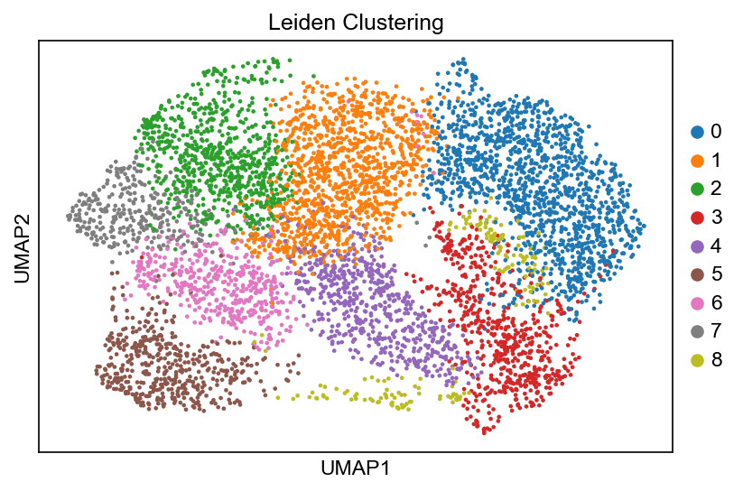
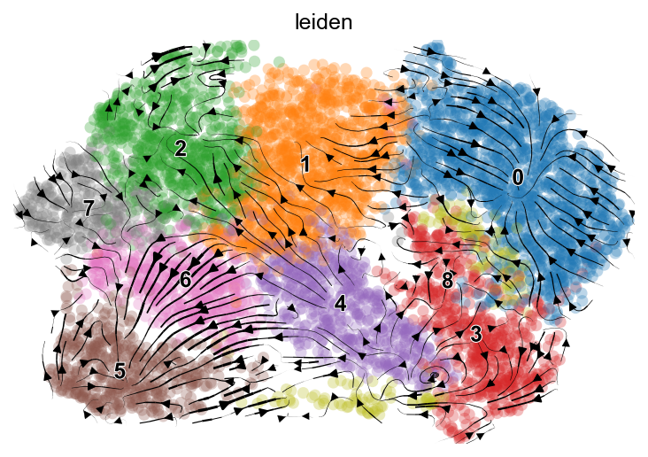
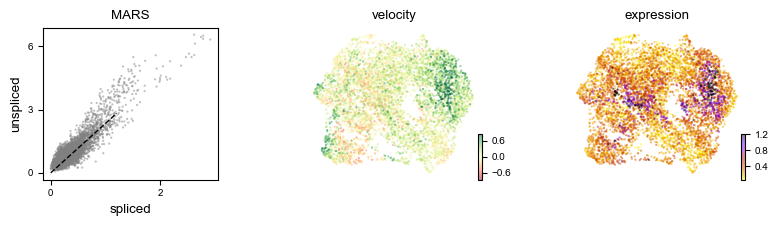
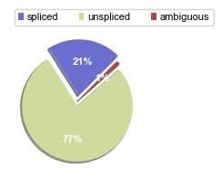

# RNA Velocity Analysis
📌 *Analysis of RNA velocity using Velocyto (CLI) and scVelo (Python).*

## 📂 Project Structure
```
RNA-Velocity-Analysis/
│── data/                 # Sample input files
│   ├── sample_alignments_DMIWJ.loom
│   ├── sample_filtered_feature_bc_matrix.h5
│── figures/              # Output visualizations
│   ├── scvelo_phase_portrait.png
│   ├── scvelo_proportions_.png
│   ├── scvelo_velo_plot.png
│   ├── umap_Leiden_Clustering.png
│── notebooks/            # Jupyter Notebook for scVelo analysis
│   ├── rna_velocity_analysis.ipynb
│── scripts/              # CLI script for Velocyto
│   ├── velocyto.sh
│── README.md             # Overview of the project
│── requirements.txt      # Required Python packages
```


## 📊 Overview  
This repository demonstrates a **bioinformatics workflow** for analyzing **RNA velocity** in single-cell transcriptomics using **Velocyto (CLI)** and **scVelo (Python)**. RNA velocity estimates the **direction and speed** of gene expression changes over time, providing insights into **cellular differentiation, transitions, and regulatory dynamics**.  

RNA velocity is particularly useful in **developmental biology, cancer research, and disease modeling**, where understanding gene expression dynamics can help predict **cell fate decisions and regulatory mechanisms**.


For a detailed explanation, check out my Medium blogs:
- 📄 [RNA Velocity Analysis Part 1 — Generating Spliced and Unspliced Counts](https://medium.com/@vishnu.vasan.r.21/rna-velocity-analysis-part-1-generating-spliced-and-unspliced-counts-cf9a3839f898)
- 📄 [RNA Velocity Analysis Part 2 — Unveiling Dynamics with scVelo](https://medium.com/@vishnu.vasan.r.21/rna-velocity-analysis-part-2-unveiling-dynamics-with-scvelo-from-counts-to-insights-275025066405)

## 🛠 Installation
1️⃣ **Clone the repository**
```bash
git clone https://github.com/your-username/RNA-Velocity-Analysis.git
cd RNA-Velocity-Analysis
```

2️⃣ **Set up a Python environment**
```bash
conda create -n rna_velocity_env python=3.9
conda activate rna_velocity_env
pip install -r requirements.txt
```

## 🏗 Usage
### 1️⃣ Generating Spliced & Unspliced Counts (Velocyto)
Run the **Velocyto** CLI tool to process **10x Genomics** data:
```bash
bash scripts/velocyto.sh
```
🔹 This script requires a **Cell Ranger output directory** and a **repeat masker annotation file**.

### 2️⃣ RNA Velocity Analysis with scVelo
Run the **Jupyter Notebook** to process and visualize RNA velocity.
```bash
jupyter notebook notebooks/rna_velocity_analysis.ipynb
```
**Steps Covered:**
- Load `.loom` file and merge with gene expression data.
- Perform **QC, normalization, and clustering**.
- Compute **RNA velocity vectors** and **velocity graphs**.
- Visualize cell transitions using **UMAP** and **stream plots**.

## 📊 Example Outputs
| Visualization | Description |
|--------------|------------|
|  | Clustered single-cell data using **Leiden clustering** |
|  | **RNA velocity stream plot** showing directional flow |
|  | **Phase portrait** of gene expression dynamics |
|  | Proportion of **spliced** and **unspliced** transcripts |

## 🔍 Alternative Approaches
While RNA velocity is a powerful method for studying transcriptomic dynamics, there are alternative approaches depending on the specific research question:

1️⃣ Pseudotime Analysis (Monocle3)
- Orders cells based on transcriptomic similarity instead of predicting future states.
- Best suited for lineage inference and trajectory mapping without requiring spliced/unspliced counts.

2️⃣ Dynamical Modeling in scVelo
- The default approach in scVelo is stochastic velocity estimation, but dynamical modeling provides gene-specific regulation insights.

3️⃣ Deep Learning-based Velocity Inference
- Emerging methods explore neural network-based inference for more accurate velocity predictions.
- Computationally expensive but could improve RNA velocity estimation in low-quality datasets.

Choosing the right method depends on:

- Data quality.
- Research question.
- Computational constraints.

## 📌 References
- [Velocyto Documentation](https://velocyto.org/)
- [scVelo Documentation](https://scvelo.readthedocs.io/)
- [10x Genomics Cell Ranger](https://support.10xgenomics.com/single-cell-gene-expression/software/pipelines/latest/what-is-cell-ranger)
